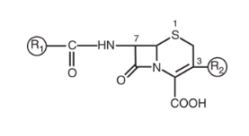
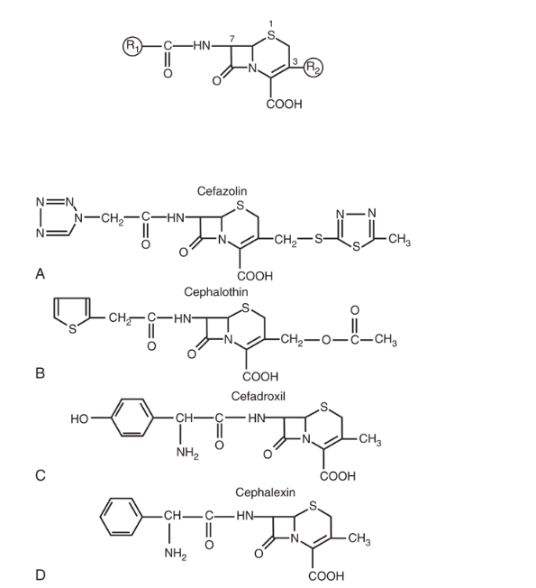
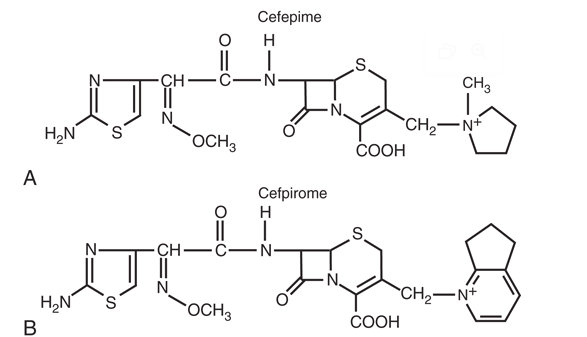
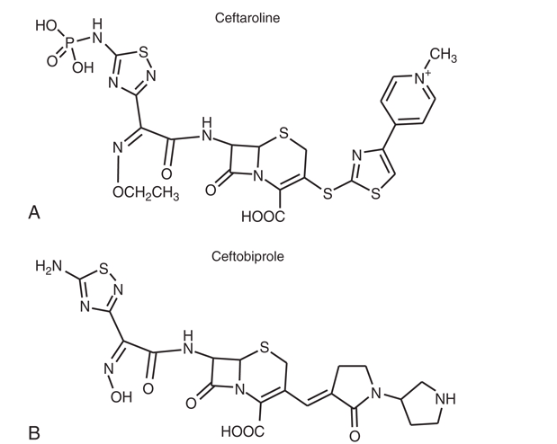
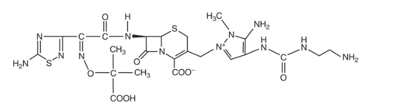
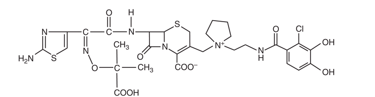

## Introduction {#sec-introduction}

Although the discovery of the cephalosporin antibiotic class was reported in 1945, it took almost two decades for this class to achieve clinical utility. Giuseppe Brotzu is widely credited for discovery of the broad-spectrum inhibitory effects of sewage outflow in Sardinia, Italy. @Brotzu1948 Professor Brotzu subsequently isolated the mold *Cephalosporin acremonium* (now *Acremonium chrysogenum*) and demonstrated antimicrobial activity of culture filtrates against both gram-positive and gram-negative bacteria. He also demonstrated the in vivo activity of these culture filtrates in animal infection models and in several patients.

::::: columns
::: {.column width="60%"}
A decade after the initial discovery, the cephalosporin substances were isolated and identified as fermentation products of the mold. @Abraham1962 Investigators at Oxford, including Florey and Abraham, systematically studied the physical, chemical, and structural characteristics of cephalosporins, as they had for the penicillin class a decade earlier. Three substances—cephalosporin P, N, and C—were identified. Each of the products possessed antimicrobial activity, but only cephalosporin C demonstrated activity against both gram-negative and gram-positive bacteria. In addition, it had advantageous stability in the presence of acid and penicillinases. Cephalosporin C became the foundation of subsequent drug development.

The first cephalosporin pharmaceutical, cephalothin, was introduced for clinical use in 1964. There are more than 20 cephalosporin antibiotics in use today. The cephalosporin class is among the most widely prescribed antimicrobial classes because of its broad spectrum of activity, low toxicity, ease of administration, and favorable pharmacokinetic profile.
:::

::: {.column width="40%"}
{fig-align="center"}
:::
:::::

::: {.callout-note}
## Historical Perspective
Brotzu noticed that locals who swam near sewage outfalls rarely developed typhoid fever, leading to his investigation. Unable to secure funding from the Italian government, he sent his cultures to the UK, where cephalosporin C was isolated at Oxford in the 1950s. It took almost **two decades** from discovery to the first clinical use in 1964.
:::

### Development Timeline {#sec-timeline}

| Year  | Milestone                                          |
|-------|----------------------------------------------------|
| 1945  | Brotzu discovers cephalosporin-producing mold      |
| 1950s | Florey & Abraham isolate cephalosporin C at Oxford |
| 1964  | Cephalothin — first clinical cephalosporin         |
| 1970s | Second-generation cephalosporins introduced        |
| 1980s | Third-generation agents (ceftriaxone, ceftazidime) |
| 2000s | Fourth and fifth generation cephalosporins         |
| 2010s | β-Lactamase inhibitor combinations approved        |

: Cephalosporin Development Timeline {#tbl-timeline}

## Chemistry {#sec-chemistry}

Most of the available cephalosporins are semisynthetic derivatives of cephalosporin C. The basic structure of the cephem nucleus includes a β-lactam ring fused to a six-member sulfur-containing dihydrothiazine ring (@fig-cephem-nucleus). The cephem nucleus is chemically distinct from the penicillin nucleus, which contains a five-member thiazolidine ring. Basic structure numbering of the cephalosporin ring system begins within the dihydrothiazine ring at the sulfur moiety. The starting material used as the nucleus for current cephalosporin development is 7-aminocephalosporanic acid (7-ACA).

::::: columns
::: {.column width="50%"}
{#fig-cephem-nucleus fig-align="center"}
:::

::: {.column width="50%"}
**Core structure features:**

- β-lactam ring fused to a 6-member dihydrothiazine ring
- Starting material: 7-aminocephalosporanic acid (7-ACA)

**Key difference from penicillins:**

- Penicillin: 5-member thiazolidine ring
- Cephalosporin: 6-member dihydrothiazine ring

::: {.callout-note}
## Structure-Activity Relationships
The 6-member ring provides greater stability to β-lactamases compared to the 5-member ring of penicillins.
:::
:::
:::::

Attempts to alter the physiochemical and biologic properties of the cephalosporins by chemical side chain modifications were based on successes with similar structural changes at the 6-aminopenicillanic acid side chain of penicillin. @Morin1963 Chemical modifications of the basic cephem structure by substitution of constituents at positions C1, C3, and C7 led to the various cephalosporin compounds in use today. @Hamilton-Miller1979 @Bryskier2000

::: {.callout-note}
## Structure-Activity Relationships
Alterations in positions C7 and C3 are commonly referred to as R1 and R2, respectively. In general:

- **R1 changes** affect the microbial spectrum of activity and stability to enzymatic destruction by β-lactamases
- **R2 modifications** alter the pharmacology of the compound, including CNS penetration and elimination half-life

A useful mnemonic: **R1 = Microbiology; R2 = Pharmacology**
:::

### R1 (C7 Position) Modifications {#sec-r1-modifications}

::::: columns
::: {.column width="50%"}
{#fig-cepham fig-align="center"}
:::

::: {.column width="50%"}
The predominant changes at R1 (position C7) include the substitution of the hydrogen with a methoxy group or the addition of an acyl side chain. The R1 methoxy substitution led to the development of the cephamycin group of compounds, including cefoxitin, cefmetazole, and cefotetan. This alteration enhanced resistance to β-lactamases produced by gram-negative anaerobic and aerobic bacteria. @Neu1982 @Fass1983 However, these compounds have lower affinity for the PBP target in gram-positive bacteria. @Curtis1979

**α-Carbon modifications at C7:**

- Hydroxyl group → Enhanced gram-negative activity (cefuroxime)
- Methoxyimino group → Third-generation spectrum
- 2-Aminothiazol group → Third/fourth-generation potency
:::
:::::

Most of the chemical modifications in cephalosporin development that have resulted in changes in microbiologic spectrum are alterations at the α-carbon of the acyl side chain. Many modifications of the acyl side chain have been undertaken. These changes have ranged from the relatively simple addition of a hydroxyl group to the addition of large synthetic moieties. Each of the acyl side chain alterations has led to enhanced gram-negative potency because of improved β-lactamase stability.

**Key structural modifications include:**

- Addition of a hydroxyl group at the α-carbon → second-generation cephalosporin cefuroxime
- Addition of a methoxyimino group in the α-position along with a furyl ring at the β-acyl side chain
- Addition of a 2-aminothiazol group to the C7 β-acyl side chain and a methoxyimino group to the α-carbon → third- and fourth-generation cephalosporins (cefotaxime, ceftizoxime, ceftriaxone, cefepime, cefpirome, cefpodoxime)

::: {.callout-important}
## Antipseudomonal Modifications
Ceftazidime and ceftolozane differ from other third-generation cephalosporins in that the methoxyimino group is replaced with a dimethylacetic acid moiety attached to the imino group. This alteration enhances activity against *Pseudomonas aeruginosa* but reduces activity against staphylococci.
:::

### R2 (C3 Position) Modifications {#sec-r2-modifications}

Numerous modifications at R2 (the C3 position) have played a significant role in the development of the current cephalosporins:

| Modification | Effect | Examples |
|-------------|--------|----------|
| Acetoxy side chain | Can be metabolized to less active desacetyl derivative; short half-life | Cephalothin, cephapirin, cefotaxime |
| Chloride substitution | Enhanced gram-negative spectrum | Cefaclor |
| Heterocyclic thiomethyl group | Increases biliary secretion; prolongs half-life due to high protein binding | Ceftriaxone |
| Positively charged quaternary ammonium moiety | Creates zwitterion; enhances outer membrane penetration; enhances activity against *P. aeruginosa* | Cefepime, cefpirome |

: R2 Position Modifications and Their Effects {#tbl-r2-modifications}

::: {.callout-warning}
## MTT Side Chain Warning
The placement of a thiomethyl tetrazole ring (methylthiotetrazole [MTT]) at the R2 position enhanced antibacterial activity but also resulted in two important adverse effects:

1. **Coagulation abnormalities** related to antagonism of vitamin K action
2. **Disulfiram-like reactions** with alcohol consumption

Cefamandole, cefotetan, cefoperazone, and moxalactam contain this MTT side chain.
:::

### Anti-MRSA Cephalosporins {#sec-anti-mrsa}

More recently, cephalosporins with enhanced activity against methicillin-resistant *Staphylococcus aureus* (MRSA) have been developed (e.g., ceftaroline and ceftobiprole). A variety of structural alterations at the C3 and C7 positions have increased the drug's stability to β-lactamase inactivation and enhanced tight binding to the altered PBP2A. @Ishikawa2003 @Bentley2006 Because some of these compounds require more lipophilicity at the C3 position for activity, prodrugs have been required to enhance aqueous solubility. @Ge2010 @Lodise2012

### Ceftolozane Structure {#sec-ceftolozane}

Ceftolozane is a 7-aminothiadiazole structure that is structurally similar to ceftazidime but contains a large pyrazole constituent at R2. This larger R2 moiety particularly inhibits AmpC β-lactamases, but also ensures that ceftolozane activity is unaffected by porin (OprD) loss and efflux pump activity. @Takeda2007 @Moya2010 These combined effects and high affinity for PBP1B, PBP1C, and PBP3 result in enhanced in vitro potency, especially against *P. aeruginosa*, compared with other agents. @Moya2012 @Moyá2019

### Siderophore Cephalosporins {#sec-siderophore}

The newest members of the cephalosporin class are the siderophore cephalosporins. Cefiderocol is the first drug of this class approved for clinical use. @Sato2016 Iron is a critical element for bacterial survival but is limited as it is tightly bound to mammalian proteins. In response, bacteria upregulate production of siderophores, which scavenge iron from the environment for bacterial use.

Structurally, siderophore cephalosporins contain the traditional cephalosporin structure with the addition of a catechol moiety at R2 that binds iron, after which it is taken up by the bacterial cell by iron transport systems in a manner that has been described as the "Trojan horse" effect. @Ito2018 The delivery of the cephalosporin into the cell allows its cellular action to take place. Siderophore cephalosporins have demonstrated activity against drug-resistant gram-negative rods, including Enterobacterales, *P. aeruginosa*, *Acinetobacter baumannii-calcoaceticus* complex, and *Stenotrophomonas maltophilia*. @Ito2016 @Hackel2017 @Falagas2017 @Kohira2016

## Mechanism of Action {#sec-mechanism}

All cephalosporins inhibit bacterial cell wall synthesis by binding to and inhibiting penicillin-binding proteins (PBPs). These enzymes are transpeptidases that catalyze formation of cross-linkages between peptidoglycan chains in the final step of bacterial cell wall synthesis. The β-lactam ring structure mimics the D-alanyl-D-alanine terminus of the peptidoglycan precursor, allowing cephalosporins to act as suicide substrates.

::::: columns
::: {.column width="50%"}
**Mechanism steps:**

1.  β-lactam ring mimics D-Ala-D-Ala terminus
2.  Binds to penicillin-binding proteins (PBPs)
3.  Inhibits transpeptidase activity
4.  Prevents peptidoglycan cross-linking
5.  Cell wall weakens → Osmotic lysis → Cell death

Different cephalosporins have varying affinities for different PBPs, which influences their spectrum of activity.
:::

::: {.column width="50%"}

:::
:::::

::: {.callout-tip}
## Clinical Pearl: Bactericidal Activity and Time-Dependent Killing
Cephalosporins are bactericidal antibiotics. Their killing is **time-dependent**, meaning that the duration of time the drug concentration remains above the minimum inhibitory concentration (MIC) correlates best with efficacy (T>MIC).

**Target:** T>MIC of **60–70%** of the dosing interval

**Clinical implications:** More frequent dosing or extended/continuous infusions are preferred, especially for serious infections in the ICU.
:::

## Classification by Generation {#sec-classification}

Cephalosporins are traditionally classified into generations based on their spectrum of antimicrobial activity. Successive generations have progressively enhanced gram-negative activity, though often at the expense of gram-positive coverage.

### Generation Overview {#sec-generation-overview}

| Generation | Gram-Positive | Gram-Negative | Special Features |
|------------|---------------|---------------|------------------|
| 1st        | ++++          | +             | MSSA, streptococci |
| 2nd        | +++           | ++            | Some anaerobes   |
| 3rd        | ++            | +++           | CNS penetration  |
| 4th        | +++           | ++++          | *Pseudomonas*, AmpC-stable |
| 5th        | ++++ (MRSA)   | ++            | Anti-MRSA        |

: Overview of Cephalosporin Activity by Generation {#tbl-generation-overview}

### First Generation {#sec-first-gen}

First-generation cephalosporins have excellent activity against gram-positive organisms, particularly methicillin-susceptible *Staphylococcus aureus* (MSSA) and streptococci. They have limited gram-negative coverage.

**Available agents:**

- **Parenteral:** Cefazolin
- **Oral:** Cephalexin, Cefadroxil

**Clinical uses:**

- Skin and soft tissue infections
- Surgical prophylaxis (cefazolin is the preferred agent; 2 g IV, or 3 g IV if >120 kg, within 60 min of incision)
- MSSA bacteremia (cefazolin is now preferred over oxacillin/nafcillin due to reduced nephrotoxicity)
- Streptococcal pharyngitis

::: {.callout-tip}
## Clinical Pearl: Cefazolin for Surgical Prophylaxis
Cefazolin is the **#1 drug for surgical prophylaxis** across most surgical specialties. It has low risk of cross-allergic reactions in patients with penicillin allergies due to its unique R1 side chain. Even in cases of previous reported anaphylaxis to penicillin, use of cefazolin for surgical prophylaxis has been shown to be quite safe. @Goodman2001
:::

### Second Generation {#sec-second-gen}

Second-generation cephalosporins have expanded gram-negative coverage compared to first-generation agents while maintaining reasonable gram-positive activity.

{#fig-2nd-gen fig-align="center"}

**Available agents:**

- **Parenteral:** Cefuroxime, Cefoxitin (cephamycin), Cefotetan (cephamycin)
- **Oral:** Cefuroxime axetil, Cefaclor, Cefprozil

::: {.callout-note}
## Cephamycins
Cefoxitin and cefotetan are technically cephamycins but are grouped with second-generation cephalosporins. They have enhanced anaerobic coverage, including many *Bacteroides fragilis* strains (50–80%), due to their α-methoxy group at C7. These agents are useful for intra-abdominal infections and OB/GYN procedures. Cefoxitin is often preferred over cefotetan due to the MTT side chain coagulopathy risk with cefotetan.
:::

### Third Generation {#sec-third-gen}

Third-generation cephalosporins have significantly enhanced gram-negative activity, including against many Enterobacterales. Most (except ceftazidime) have diminished gram-positive activity compared to first-generation agents.

::::: columns
::: {.column width="50%"}
{#fig-3rd-gen fig-align="center"}
:::

::: {.column width="50%"}
**Available agents:**

- **Parenteral:** Ceftriaxone, Cefotaxime, Ceftazidime
- **Oral:** Cefixime, Cefpodoxime, Cefdinir, Ceftibuten

**Key features:**

- Most penetrate CSF with inflamed meninges
- Reduced gram-positive activity (except ceftriaxone)
- Significantly enhanced gram-negative coverage
:::
:::::

**Ceftriaxone highlights:**

- High protein binding (85–95%) → dual renal and biliary elimination → Half-life: **6–9 hours** → Once-daily dosing
- Biliary excretion (40%) → **No renal dose adjustment** needed
- Excellent CSF penetration; IM option available
- Common uses: community-acquired pneumonia, bacterial meningitis, gonorrhea, Lyme disease

::: {.callout-warning}
## Ceftazidime: Unique Spectrum
Ceftazidime has **antipseudomonal** activity but poor gram-positive coverage (especially streptococci). It should **not** be used for streptococcal or staphylococcal infections. Best uses: *Pseudomonas* infections, nosocomial gram-negative infections, febrile neutropenia (in combination). The structural modification that gives ceftazidime antipseudomonal activity removes gram-positive activity.
:::

### Fourth Generation {#sec-fourth-gen}

Fourth-generation cephalosporins combine enhanced gram-negative activity with improved gram-positive coverage compared to third-generation agents.

::::: columns
::: {.column width="50%"}
**Available agents:**

- Cefepime (parenteral only)

**Distinguishing features:**

- Zwitterionic structure allows rapid penetration through gram-negative outer membrane
- Enhanced stability against AmpC β-lactamases
- Maintains activity against *P. aeruginosa*
- Better gram-positive coverage than ceftazidime

**Dosing:** 1–2 g IV q8–12h
:::

::: {.column width="50%"}
{#fig-4th-gen fig-align="center"}
:::
:::::

::: {.callout-warning}
## Cefepime Neurotoxicity
Cefepime can cause CNS toxicity (encephalopathy, myoclonus, seizures) via GABA-A antagonism, particularly in patients with renal impairment. Monitor for altered mental status. TDM targets: keep troughs **<10–15 mg/L** and definitely **<20–22 mg/L**. Adjust dose for renal impairment.
:::

### Fifth Generation (Anti-MRSA) {#sec-fifth-gen}

Fifth-generation cephalosporins have activity against MRSA due to enhanced binding to PBP2A.

::::: columns
::: {.column width="50%"}
**Available agents:**

- Ceftaroline (parenteral only)
- Ceftobiprole (not available in US)

**FDA-approved indications for ceftaroline:**

- Acute bacterial skin and skin structure infections (ABSSSI)
- Community-acquired bacterial pneumonia (CABP)

**Dosing:** 600 mg IV q12h (or q8h for MRSA bacteremia, off-label)
:::

::: {.column width="50%"}
{#fig-5th-gen fig-align="center"}
:::
:::::

::: {.callout-important}
## Ceftaroline Spectrum
Ceftaroline binds to **PBP2A** → Activity against MRSA. However, it does **NOT** have activity against *Pseudomonas aeruginosa* or extended-spectrum β-lactamase (ESBL)-producing organisms.
:::

### Generation Comparison Summary {#sec-generation-comparison}

| Feature          | 1st Gen | 3rd Gen | 4th Gen | 5th Gen |
|------------------|---------|---------|---------|---------|
| MSSA             | ++++    | ++      | +++     | +++     |
| MRSA             | −       | −       | −       | ++++    |
| Streptococcus    | ++++    | +++     | +++     | +++     |
| Enterobacterales | +       | +++     | ++++    | ++      |
| *Pseudomonas*    | −       | +/−     | ++      | −       |
| Anaerobes        | −       | +/−     | +/−     | −       |

: Cephalosporin Spectrum Comparison by Generation {#tbl-generation-comparison}

## β-Lactamase Inhibitor Combinations {#sec-bli-combinations}

Several cephalosporin/β-lactamase inhibitor combinations have been developed to address the challenge of β-lactamase-mediated resistance:

### Ceftolozane-Tazobactam {#sec-ceftol-tazo}

Ceftolozane-tazobactam combines a novel cephalosporin with antipseudomonal activity with the β-lactamase inhibitor tazobactam.

::::: columns
::: {.column width="50%"}
**Key features:**

- Excellent activity against *P. aeruginosa*, including many multidrug-resistant strains
- Activity against ESBL-producing Enterobacterales
- Intrinsic AmpC stability
- **No activity** against carbapenemase-producing organisms (KPC, MBL)
- FDA approved for complicated UTI, complicated intra-abdominal infections (with metronidazole), and hospital-acquired/ventilator-associated bacterial pneumonia

**Dosing:**

- 1.5–3 g IV q8h
- Extended infusion: 3 g over 3 h q8h (for serious infections)
:::

::: {.column width="50%"}
{#fig-ceftolozane fig-align="center"}
:::
:::::

### Ceftazidime-Avibactam {#sec-ceftaz-avi}

Ceftazidime-avibactam pairs ceftazidime with avibactam, a novel diazabicyclooctane β-lactamase inhibitor.

**Avibactam inhibits:**

- KPC (Class A carbapenemases)
- OXA-48 (Class D)
- AmpC (Class C)
- ESBLs

**Key features:**

- Activity against KPC-producing Enterobacterales
- Activity against OXA-48-producing organisms
- Activity against AmpC-producing organisms
- **No activity** against metallo-β-lactamase (MBL) producers (NDM, VIM, IMP)
- FDA approved for complicated UTI, complicated IAI, hospital-acquired pneumonia

**Dosing:** 2.5 g IV q8h

### Cefiderocol {#sec-cefiderocol}

Cefiderocol is a siderophore cephalosporin with a unique mechanism of cell entry.

{#fig-cefiderocol fig-align="center" width="60%"}

::: {.callout-tip}
## "Trojan Horse" Mechanism
- Contains a catechol moiety that binds iron
- Hijacks bacterial iron transport systems
- Delivers the cephalosporin directly into the bacterial cell
:::

**Unique spectrum:**

- Activity against carbapenem-resistant gram-negative organisms, including **MBL producers** (NDM, VIM, IMP)
- Active against *Acinetobacter baumannii* complex
- Active against *Stenotrophomonas maltophilia*
- Carbapenem-resistant Enterobacterales

**Dosing:** 2 g IV q8h (3-hour infusion)

### BLI Combination Comparison {#sec-bli-comparison}

| Feature           | Ceftolozane-Tazobactam | Ceftazidime-Avibactam | Cefiderocol |
|-------------------|------------------------|----------------------|-------------|
| MDR *Pseudomonas* | ++++                   | ++                   | +++         |
| ESBL              | +++                    | ++++                 | +++         |
| KPC               | −                      | ++++                 | +++         |
| MBL               | −                      | −                    | ++++        |
| OXA-48            | −                      | ++++                 | +++         |
| *Acinetobacter*   | +                      | +                    | ++++        |

: β-Lactamase Inhibitor Combination Comparison {#tbl-bli-comparison}

Agent selection depends on the specific resistance mechanism present. Know your local epidemiology.

## Pharmacokinetics {#sec-pharmacokinetics}

### Absorption {#sec-absorption}

Oral cephalosporins vary in their bioavailability:

| Drug | Bioavailability | Effect of Food |
|------|-----------------|----------------|
| Cephalexin | 90-100% | Minimal effect |
| Cefadroxil | 90-100% | Minimal effect |
| Cefuroxime axetil | 37-52% | Increased with food |
| Cefpodoxime proxetil | ~50% | Increased with food |
| Cefixime | 40-50% | Not significantly affected |

: Oral Cephalosporin Bioavailability {#tbl-bioavailability}

::: {.callout-tip}
## Prodrug Formulations
Prodrug formulations (axetil, proxetil) should be taken **with food** to improve absorption. Consider the relatively low bioavailability of some oral agents when treating serious infections.
:::

### Distribution {#sec-distribution}

Cephalosporins distribute widely into most body tissues and fluids. Important considerations:

- **CSF penetration:** Third-generation cephalosporins (ceftriaxone, cefotaxime) achieve therapeutic CSF concentrations in the presence of inflamed meninges
- **Bone penetration:** Most cephalosporins achieve adequate bone concentrations for osteomyelitis treatment
- **Protein binding:** Varies widely (ceftriaxone 83-96% vs. cefazolin 74-86%)

#### CNS Penetration {#sec-cns-penetration}

**Cephalosporins with good CSF penetration (inflamed meninges):**

| Agent | CSF Penetration (% of serum) |
|-------|------------------------------|
| Ceftriaxone | 10–20% |
| Cefotaxime | 10–30% |
| Ceftazidime | 20–40% |
| Cefepime | 10–25% |

**Poor CNS penetration:** Classic teaching holds that first-generation cephalosporins do not penetrate the CNS adequately; however, modern data show that high-dose cefazolin (e.g., high-dose IV every 8 hours) can achieve sufficient CSF concentrations to treat susceptible *Staphylococcus aureus*. Second-generation cephalosporins have generally poor CNS penetration.

### Elimination {#sec-elimination}

Most cephalosporins are eliminated primarily by renal excretion.

#### Half-Life and Dosing Intervals {#sec-half-life}

| Drug        | Half-Life | Usual Interval |
|-------------|-----------|----------------|
| Cefazolin   | 1.5–2 h   | q8h            |
| Cefuroxime  | 1–2 h     | q8h            |
| Cefotaxime  | ~1 h      | q6–8h          |
| Ceftazidime | 1.5–2 h   | q8h            |
| Ceftriaxone | **6–9 h** | **q24h**       |
| Cefepime    | ~2 h      | q8–12h         |

: Cephalosporin Half-Lives and Dosing Intervals {#tbl-half-life}

::: {.callout-tip}
## Clinical Pearl: Ceftriaxone Exception
Ceftriaxone is unique among cephalosporins in that it undergoes significant biliary excretion (40%) in addition to renal elimination. This makes it useful in patients with renal impairment **without dose adjustment**. Avoid in severe liver disease combined with renal impairment.
:::

### Prolonged Infusion Strategies {#sec-prolonged-infusion}

Because cephalosporin efficacy is time-dependent (T>MIC), prolonged infusion strategies can optimize pharmacodynamic target attainment, particularly for critically ill patients.

**Options:**

- **Extended infusion:** 3–4 hour infusion of each dose
- **Continuous infusion:** 24-hour infusion (requires stability data for the specific agent)

**Best evidence for:** Cefepime, ceftazidime, ceftolozane-tazobactam — especially in ICU patients, patients with MDR pathogens, or when high MIC breakpoints are encountered.

## Dosing Adjustments {#sec-dosing}

### Renal Impairment {#sec-renal-dosing}

Most cephalosporins require dose adjustment in renal impairment. See @tbl-renal-dosing for recommendations.

| Cephalosporin | Usual Adult Dose | GFR 31-50 | GFR 11-30 | GFR ≤10 | Hemodialysis |
|---------------|------------------|-----------|-----------|---------|--------------|
| **First Generation** |
| Cefazolin | 1-2 g q8h | NC | 1-2 g q12h | 1 g q24h | 0.5-1 g q24h after HD |
| **Second Generation** |
| Cefuroxime | 0.75-1.5 g q8h | NC | 0.75-1.5 g q12h | 0.75-1.5 g q24h | 0.75-1.5 g q24h after HD |
| Cefoxitin | 1-2 g q6-8h | 1-2 g q8-12h | 1-2 g q12-24h | 0.5-1 g q12-24h | 1-2 g after HD |
| **Third Generation** |
| Cefotaxime | 1-2 g q4-8h | 1-2 g q6-12h | 1-2 g q6-12h | 1-2 g q12-24h | 1-2 g q12-24h after HD |
| Ceftazidime | 1-2 g q8h | 1-2 g q12h | 1-2 g q24h | 0.5-1 g q24h | 0.5-1 g q24h after HD |
| Ceftriaxone | 1-2 g q24h | NC | NC | NC | NC |
| **Fourth Generation** |
| Cefepime | 1-2 g q8-12h | 1-2 g q12-24h | 0.5-2 g q12-24h | 0.25-1 g q24h | 1 g q24h after HD |
| **Fifth Generation** |
| Ceftaroline | 600 mg q8-12h | 400 mg q8-12h | 300 mg q8-12h | 200 mg q8-12h | 200 mg q8-12h after HD |

: Cephalosporin Dosing Adjustments for Renal Impairment {#tbl-renal-dosing}

*NC = no change; HD = hemodialysis*

### Pediatric Dosing {#sec-pediatric-dosing}

Pediatric dosing is weight-based. Maximum doses generally should not exceed adult limits.

| Drug        | Mild–Moderate Infection  | Severe Infection                       |
|-------------|--------------------------|----------------------------------------|
| Cefazolin   | 25–50 mg/kg divided q8h  | 100–150 mg/kg divided q6–8h            |
| Ceftriaxone | 50–75 mg/kg/dose q24h    | 80–100 mg/kg/day divided q12–24h       |
| Cefepime    | 50 mg/kg q12h            | 50 mg/kg q8h                           |

: Pediatric Cephalosporin Dosing {#tbl-pediatric-dosing}

## Adverse Effects {#sec-adverse-effects}

Cephalosporins are generally well-tolerated antibiotics. The most common adverse effects are summarized in @tbl-adverse-effects.

| Effect Type | Specific Effect | Frequency (%) |
|-------------|-----------------|---------------|
| **Hypersensitivity** | Rash | 1-3 |
| | Urticaria, Serum sickness | <1 |
| | Anaphylaxis | 0.01 |
| **Gastrointestinal** | Diarrhea | 1-19 |
| | Nausea and vomiting | 1-6 |
| | Transient transaminase elevation | 1-7 |
| | Biliary sludge (ceftriaxone) | 20-46 |
| **Hematologic** | Eosinophilia | 1-10 |
| | Neutropenia | <1 |
| | Thrombocytopenia | <1-3 |
| | Hypoprothrombinemia | <1 |
| | Hemolytic anemia | <1 |
| | Positive Coombs test | ~3 |
| **Renal** | Interstitial nephritis | <1-5 |
| **CNS** | Seizures | <1 |
| | Encephalopathy | <1 |
| **Other** | Drug fever | Rare |
| | Disulfiram-like reaction (MTT) | Rare |

: Potential Adverse Effects of Cephalosporins {#tbl-adverse-effects}

### Cross-Reactivity with Penicillin Allergy {#sec-cross-reactivity}

::: {.callout-warning}
## Penicillin Allergy Considerations
The true cross-reactivity between penicillins and cephalosporins is approximately **1-2%** for IgE-mediated reactions, much lower than the historically quoted 10%. Key considerations:

- Cross-reactivity is primarily related to **R1 side chain similarity**, not the β-lactam ring
- First-generation cephalosporins (cephalexin) have similar side chains to aminopenicillins — however, cefazolin has a unique R1 side chain and lower cross-reactivity risk
- Third and fourth-generation cephalosporins have very low cross-reactivity
- Many patients labeled "penicillin allergic" can safely receive cephalosporins
- Patients with severe IgE-mediated penicillin reactions should avoid cephalosporins with similar side chains
:::

### CNS Toxicity {#sec-cns-toxicity}

Adverse reactions in the nervous system are uncommon and are similar in nature to those reported with other β-lactams. The main mechanism of neurotoxicity is inhibition of γ-aminobutyric acid A (GABA-A). Encephalopathy and seizures have been reported primarily in patients with renal insufficiency who were receiving high doses of these drugs, in particular with cefepime use. @Chow2005 @Sonck2008 Decreased protein binding and inhibition of the choroid plexus pump occur with uremia and may contribute to enhanced toxicity in patients with renal impairment.

::: {.callout-warning}
## Cefepime Neurotoxicity Monitoring
Cefepime-associated encephalopathy can be subtle — always consider it in patients with unexplained mental status changes, myoclonus, or seizures. Risk increases substantially when troughs exceed 20–22 mg/L. TDM targets: troughs **<10–15 mg/L** (ideally), and never **>20 mg/L**. Dose adjust for renal impairment and verify creatinine clearance before prescribing.
:::

### Hematologic Effects {#sec-hematologic}

**Coagulation abnormalities (MTT side chain):**

- Hypoprothrombinemia via vitamin K antagonism
- Affects cefotetan and cefoperazone (both contain MTT at R2)
- Consider vitamin K supplementation, especially in malnourished patients; counsel patients to avoid alcohol

**Other hematologic effects:**

- Eosinophilia (1–10%)
- Neutropenia (<1%, with prolonged use)
- Positive Coombs test (~3%)
- Hemolytic anemia (rare)

### Ceftriaxone-Specific Concerns {#sec-ceftriaxone-concerns}

::: {.callout-caution}
## Biliary Sludge and Pseudolithiasis
Ceftriaxone can precipitate as calcium-ceftriaxone salt in the gallbladder, causing "biliary sludge" or pseudolithiasis. This occurs in 20-46% of patients (especially children) and is usually asymptomatic and reversible within 10-60 days after drug discontinuation.

**Important:** Ceftriaxone and calcium-containing products should not be mixed in vials or infusion lines for therapy in neonates younger than 28 days due to risk of precipitation.
:::

## Major Clinical Uses {#sec-clinical-uses}

### Surgical Prophylaxis {#sec-surgical-prophylaxis}

Cefazolin is the preferred agent for most surgical prophylaxis indications:

- Cardiac surgery
- Vascular surgery
- Orthopedic procedures (joint replacement, spine surgery)
- Head and neck surgery crossing oropharyngeal mucosa (add metronidazole)
- Vaginal and abdominal hysterectomy
- High-risk cesarean section
- High-risk gastroduodenal and biliary procedures

**Dosing:** 2 g IV (3 g IV if >120 kg) within 60 minutes of incision.

::: {.callout-tip}
## Clinical Pearl: Penicillin Allergy and Surgical Prophylaxis
Even in cases of previous reported anaphylaxis to penicillin, use of cefazolin for surgical prophylaxis has been shown to be quite safe. In one study, there were no incidences of anaphylaxis in 77 patients who were given cefazolin for surgical prophylaxis despite having penicillin anaphylaxis history. @Goodman2001
:::

### Skin and Soft Tissue Infections {#sec-ssti}

- **Uncomplicated cellulitis/erysipelas:** Cephalexin or cefazolin
- **MSSA skin abscesses:** Cephalexin or cefazolin
- **MRSA infections:** Ceftaroline

### Respiratory Tract Infections {#sec-respiratory}

**Community-acquired pneumonia (inpatient, non-ICU):**

- Ceftriaxone 1–2 g IV q24h + Azithromycin
- OR Respiratory fluoroquinolone monotherapy

**Community-acquired pneumonia (ICU):**

- Ceftriaxone 2 g IV q24h + Azithromycin or respiratory fluoroquinolone

**Hospital-acquired / Ventilator-associated pneumonia (antipseudomonal options):**

- Cefepime 2 g IV q8h
- Ceftazidime 2 g IV q8h
- Ceftolozane-tazobactam 3 g IV q8h (extended infusion preferred)
- Add vancomycin or linezolid if MRSA risk; adjust based on local resistance patterns and susceptibilities

### Central Nervous System Infections {#sec-cns-infections}

**Bacterial meningitis (empiric):**

- Ceftriaxone 2 g IV q12h (or Cefotaxime 2 g IV q4–6h)
- PLUS Vancomycin (for resistant *S. pneumoniae*)
- ± Ampicillin if *Listeria* risk (elderly, immunocompromised, pregnant)

::: {.callout-important}
## Critical Point
Third-generation cephalosporins penetrate CSF well with inflamed meninges but are **NOT effective against *Listeria monocytogenes***.
:::

### Urinary Tract Infections {#sec-uti}

**Uncomplicated cystitis:** Cephalexin 500 mg PO q6h (alternative agent; not first-line due to collateral damage concerns)

**Complicated UTI / Pyelonephritis:**

- Ceftriaxone 1 g IV q24h
- Cefepime 1 g IV q8h
- Ceftolozane-tazobactam 1.5 g IV q8h (resistant *Pseudomonas*)
- Ceftazidime-avibactam 2.5 g IV q8h (KPC/OXA-48 producers)
- Cefiderocol 2 g IV q8h (MBL producers, pan-resistant organisms)

### Intra-abdominal Infections {#sec-iai}

**Community-acquired (mild–moderate):**

- Cefoxitin or cefotetan alone
- Ceftriaxone or cefotaxime + metronidazole

**Healthcare-associated / Resistant pathogens:**

- Ceftolozane-tazobactam + metronidazole
- Ceftazidime-avibactam + metronidazole
- Cefepime + metronidazole

## Antimicrobial Resistance {#sec-resistance}

### β-Lactamase Classification {#sec-beta-lactamase-classification}

β-Lactamases are classified by the Ambler system into four molecular classes based on their active site:

| Class | Type          | Examples            | Inhibited by Avibactam? |
|-------|---------------|---------------------|-------------------------|
| A     | Serine        | ESBLs (CTX-M), KPC  | Yes                     |
| B     | Metallo (MBL) | NDM, VIM, IMP       | **No**                  |
| C     | AmpC          | Chromosomal, CMY    | Yes                     |
| D     | OXA           | OXA-48, OXA-181     | Yes                     |

: Ambler β-Lactamase Classification {#tbl-ambler-classes}

::: {.callout-important}
## Key Point: Metallo-β-Lactamases
Metallo-β-lactamases (Class B) are **NOT** inhibited by avibactam or tazobactam. Only **cefiderocol** maintains reliable activity against MBL-producing organisms.
:::

### Extended-Spectrum β-Lactamases (ESBLs) {#sec-esbl}

**ESBLs:**

- Hydrolyze third-generation cephalosporins
- Common types: CTX-M, SHV, TEM variants
- Often co-resistant to fluoroquinolones

**Treatment options for ESBL-producing Enterobacterales:**

- Carbapenems (traditional standard of care)
- Ceftolozane-tazobactam (active against most ESBLs)
- Ceftazidime-avibactam

### β-Lactamases and Cephalosporin Coverage {#sec-beta-lactamases}

| β-Lactamase Type | Examples | Affected Cephalosporins | Agents with Activity |
|------------------|----------|------------------------|---------------------|
| ESBL | CTX-M, SHV, TEM variants | Most 3rd generation | Ceftolozane-tazobactam, Ceftazidime-avibactam |
| AmpC | Chromosomal (Enterobacter, Citrobacter) | 3rd generation | Cefepime, Ceftazidime-avibactam |
| KPC | KPC-2, KPC-3 | All cephalosporins | Ceftazidime-avibactam |
| MBL | NDM, VIM, IMP | All cephalosporins | Cefiderocol |
| OXA-48-like | OXA-48, OXA-181 | All cephalosporins | Ceftazidime-avibactam |

: β-Lactamase Types and Cephalosporin Activity {#tbl-beta-lactamases}

### Carbapenem-Resistant Enterobacterales (CRE) {#sec-cre}

The resistance mechanism determines treatment selection for CRE:

| Mechanism      | Agent of Choice       |
|----------------|-----------------------|
| KPC            | Ceftazidime-avibactam |
| OXA-48         | Ceftazidime-avibactam |
| MBL (NDM, VIM) | Cefiderocol           |

: Treatment Selection for CRE by Carbapenemase Type {#tbl-cre}

::: {.callout-tip}
## Clinical Pearl
Know your **local epidemiology**: KPC predominates in some regions (e.g., US, Italy, Greece), while MBL (NDM) is more prevalent in others (e.g., South Asia). Rapid molecular diagnostics can identify carbapenemase type and guide therapy.
:::

### AmpC β-Lactamases {#sec-ampc}

Certain organisms harbor inducible chromosomal AmpC β-lactamases and can develop resistance during third-generation cephalosporin therapy by de-repression of AmpC expression. These are sometimes remembered by the mnemonic **"HECK-Yes"**:

::::: columns
::: {.column width="50%"}
**HECK-Yes organisms (inducible AmpC):**

- **H**afnia alvei
- **E**nterobacter cloacae
- **C**itrobacter freundii
- **K**lebsiella aerogenes
- **Y**ersinia enterocolitica
- **E**nterobacter species
- **S**erratia marcescens
:::

::: {.column width="50%"}
**Preferred agents for serious AmpC infections:**

- **Cefepime** (stable to AmpC)
- Ceftazidime-avibactam
- Carbapenems

**Avoid:** Ceftriaxone monotherapy for serious infections due to *Enterobacter* — resistance can emerge on therapy.
:::
:::::

### PBP Alterations {#sec-pbp-alterations}

- **MRSA:** Altered PBP2A confers resistance to all cephalosporins except ceftaroline and ceftobiprole
- **Penicillin-resistant *S. pneumoniae*:** Altered PBPs may reduce cephalosporin susceptibility

## Special Considerations {#sec-special-considerations}

### Pregnancy and Lactation {#sec-pregnancy}

Most cephalosporins are Pregnancy Category B (no evidence of teratogenicity). They cross the placenta and are used routinely in obstetric practice. They are excreted in small amounts in breast milk and are generally considered compatible with breastfeeding. Cephalosporins are among the safest antibiotics in pregnancy.

### Prolonged Infusion in the ICU {#sec-icu-infusion}

Prolonged infusion strategies are particularly valuable in critically ill patients to maximize T>MIC against less-susceptible pathogens:

- **Extended infusion:** Administer each dose over 3–4 hours (e.g., cefepime 2 g over 4h q8h)
- **Continuous infusion:** Requires stability data; used primarily for ceftazidime, cefepime, and ceftolozane-tazobactam
- These strategies may allow dose reduction while maintaining efficacy or improve outcomes when MICs are near the breakpoint

## Key Takeaways {#sec-key-takeaways}

1. **Structure:** β-lactam ring + dihydrothiazine ring; R1 affects spectrum, R2 affects pharmacology
2. **Mechanism:** Inhibit PBPs → prevent cell wall synthesis → bactericidal; efficacy is time-dependent (T>MIC)
3. **Generations:** 1st (gram-positive/prophylaxis), 2nd (some GN/anaerobes), 3rd (broad GN/CNS), 4th (broad including *Pseudomonas*/AmpC), 5th (MRSA)
4. **Cefazolin:** First-line for surgical prophylaxis; 2 g IV (3 g if >120 kg)
5. **Ceftriaxone:** Once-daily, no renal adjustment, excellent CNS penetration
6. **BLI combinations:** Match to resistance mechanism — KPC → ceftazidime-avibactam; MBL → cefiderocol
7. **Cross-reactivity:** True IgE-mediated rate ~1–2%; consider specific R1 side chains
8. **Cefepime neurotoxicity:** Monitor mental status in renal impairment; keep troughs <20 mg/L

## Conclusion {#sec-conclusion}

Cephalosporins remain a cornerstone of antimicrobial therapy due to their broad spectrum, favorable safety profile, and availability in both oral and parenteral formulations. The development of newer agents with activity against resistant pathogens, including MRSA and carbapenem-resistant gram-negative organisms, ensures this class will continue to play a vital role in treating infectious diseases. Understanding the structure-activity relationships, pharmacokinetic properties, and resistance mechanisms helps clinicians select the most appropriate cephalosporin for each clinical situation.

## References {#sec-references}
