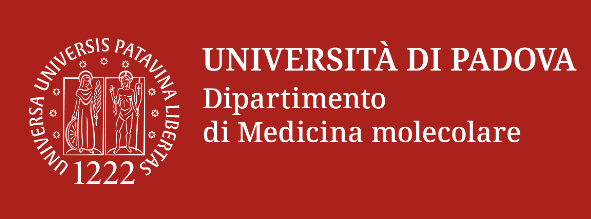
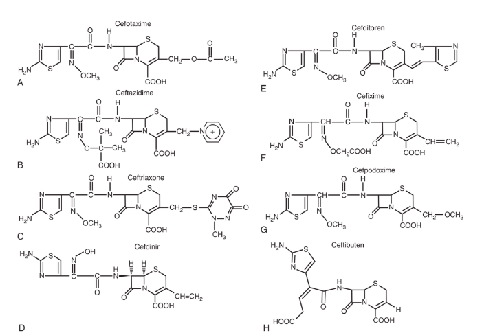

## Cephalosporins and   Cephalosporin-β-Lactamase Inhibitors {background-color="#b20e10"}

   

**Russell E. Lewis**   Associate Professor of Infectious Diseases   Department of Molecular Medicine   University of Padua

{fig-align="center" width="404"}

   russelledward.lewis\@unipd.it    [https://github.com/Russlewisbo](https://github.com/Russlewisbo/ESCMID_2022_talk)   Slides and course materials: [www.idpadova.com](https://padovaid.com/)

## Learning objectives

 

**After this presentation, you will be able to:**

1.  Describe the structure and mechanism of action of cephalosporins
2.  Classify cephalosporins by generation and spectrum
3.  Compare pharmacokinetic properties across generations
4.  Select appropriate cephalosporins for common infections
5.  Recognize important adverse effects and drug interactions
6.  Apply knowledge of β-lactamase inhibitor combinations

# Historical Overview {background-color="#b20e10"}

## Discovery of cephalosporins:   From Sardinian sewage to modern medicine

::::: columns
::: {.column width="50%"}
**1945: Giuseppe Brotzu** discovers antimicrobial activity

- Epidemiologist working in Sardinia, Italy
- Isolated *Cephalosporin acremonium* from sewage outflow
- Demonstrated activity of filtrate against gram-positive AND gram-negative bacteria
- Could not find resources from Italian government to develop antibiotic- sent to UK where cephalosporin C was isolated in the 1950s
:::

::: {.column width="50%"}
{fig-align="center"}
:::
:::::

 

::: callout-note
## Amazing fact

Brotzu noticed that locals who swam near sewage outfalls rarely developed typhoid fever, leading to his investigation. It took almost **two decades** from discovery to clinical use (1964)!
:::

## Development timeline

 

| Year  | Milestone                                          |
|-------|----------------------------------------------------|
| 1945  | Brotzu discovers cephalosporin-producing mold      |
| 1950s | Florey & Abraham isolate cephalosporin C at Oxford |
| 1964  | Cephalothin - first clinical cephalosporin         |
| 1970s | Second-generation cephalosporins                   |
| 1980s | Third-generation (ceftriaxone, ceftazidime)        |
| 2000s | Fourth and fifth generation                        |
| 2010s | β-lactamase inhibitor combinations                 |

::: notes
The development of cephalosporins parallels the evolution of bacterial resistance - each new generation addressed emerging resistance patterns.
:::

## Why cephalosporins matter today

 

**\>20 cephalosporins** in clinical use

Among the **most widely prescribed** antibiotic class due to:

- Broad spectrum of activity
- Low toxicity profile
- Ease of administration
- Favorable pharmacokinetics
- Multiple routes (IV, IM, PO)

# Chemistry & Structure {background-color="#b20e10"}

## Basic cephem nucleus

 

::::: columns
::: {.column width="50%"}
{fig-align="center"}
:::

::: {.column width="50%"}
**Core structure:**

- β-lactam ring fused to a 6-member dihydrothiazine ring
- Starting material: 7-aminocephalosporanic acid (7-ACA)

**Key difference from penicillins:**

- Penicillin: 5-member thiazolidine ring
- Cephalosporin: 6-member dihydrothiazine ring
:::
:::::

::: aside
The 6-member ring provides greater stability to β-lactamases compared to the 5-member ring of penicillins.
:::

## Structure-activity relationships

 

**Two key modification sites:**

| Position       | Common Name | Effect on Drug                               |
|-------------------|-------------------|----------------------------------|
| C7 (acyl side) | **R1**      | Spectrum of activity; β-lactamase stability  |
| C3             | **R2**      | Pharmacokinetics; Half-life; CNS penetration |

::: callout-tip
## Remember

R1 = Microbiology; R2 = Pharmacology
:::

::: aside
Understanding these modifications helps explain why different generations have different spectra and pharmacokinetic profiles.
:::

## R1 Modifications: Enhancing spectrum

 

::::: columns
::: {.column width="50%"}
{fig-align="center" width="400"}
:::

::: {.column width="50%"}
**α-Carbon modifications at C7:**

- Hydroxyl group → Enhanced gram-negative (cefuroxime)
- Methoxyimino group → 3rd generation spectrum
- 2-Aminothiazol group → 3rd/4th generation potency

**Cephamycins**

- Methoxy substitution at C7 → Cefoxitin, Cefotetan

- Enhanced anaerobic coverage

- Resistance to many β-lactamases

- BUT: Reduced gram-positive activity
:::
:::::

::: aside
The cephamycins are technically different compounds but grouped with 2nd generation cephalosporins clinically. First-generation cephalosporins.(A) Cefazolin. (B) Cephalothin. (C) Cefadroxil. (D) Cephalexin.
:::

## R2 Modifications: Changing pharmacology

 

| Modification           | Effect                            | Example     |
|------------------------|-----------------------------------|-------------|
| Acetoxy side chain     | Short half-life                   | Cephalothin |
| Thiomethyl heterocycle | Long half-life, biliary excretion | Ceftriaxone |
| Quaternary ammonium    | Zwitterion, better GN penetration | Cefepime    |

   

::: callout-warning
## MTT side chain warning

Methylthiotetrazole (MTT) at R2:

- Coagulation abnormalities (vitamin K antagonism)
- Disulfiram-like reactions

Found in: Cefamandole, Cefotetan, Cefoperazone
:::

::: notes
The MTT side chain drugs require vitamin K supplementation and alcohol avoidance counseling.
:::

# Mechanism of Action {background-color="#b20e10"}

## PBP inhibition

 

::::: columns
::: {.column width="50%"}
**All β-lactams share the same mechanism:**

1.  β-lactam ring mimics D-Ala-D-Ala terminus
2.  Binds to penicillin-binding proteins (PBPs)
3.  Inhibits transpeptidase activity
4.  Prevents peptidoglycan cross-linking
5.  Cell wall weakens → Osmotic lysis → Cell death
:::

::: {.column width="50%"}

:::
:::::

     

::: aside
PBPs are the target enzymes. Different cephalosporins have varying affinities for different PBPs, which affects their spectrum.
:::

## Pharmacodynamic properties

 

::: callout-important
## Key Concept: Time-dependent killing

Cephalosporin efficacy correlates with **T\>MIC** (Time drug concentration remains above MIC)
:::

  **Target:** T\>MIC of **60-70%** of dosing interval

**Clinical implications:**

- More frequent dosing OR
- Extended/continuous infusions
- Especially important for serious infections

::: aside
This is why prolonged-infusion strategies have become common for β-lactams in ICU settings.
:::

# Classification by Generation {background-color="#b20e10"}

## Overview of generations

 

| Generation | Gram-Positive | Gram-Negative | Special Features |
|------------|---------------|---------------|------------------|
| 1st        | ++++          | \+            | MSSA, strep      |
| 2nd        | +++           | ++            | Some anaerobes   |
| 3rd        | ++            | +++           | CNS penetration  |
| 4th        | +++           | ++++          | *Pseudomonas*    |
| 5th        | ++++ (MRSA)   | ++            | Anti-MRSA        |

   

::: aside
This is a simplification - individual agents within generations vary.
:::

## First generation cephalosporins

 

**Available agents:**

- **IV:** Cefazolin (workhorse)
- **PO:** Cephalexin, Cefadroxil

**Spectrum:**

- Excellent: MSSA, Streptococci
- Moderate: Some Enterobacterales
- Poor: *H. influenzae*, *M. catarrhalis*, anaerobes

::: callout-tip
## Clinical Pearl

Cefazolin is the **#1 drug for surgical prophylaxis**
:::

::: aside
First-generation agents remain essential despite their age.   Cefazolin is used millions of times yearly for surgical prophylaxis. Low risk of cross-allergic reactions in patients with PCN allergies due to unique R1 side chain
:::

## First generation: Clinical uses

 

**Primary indications:**

1.  **Surgical prophylaxis** (cefazolin)

    - Cardiac, vascular, orthopedic surgery
    - Clean procedures

2.  **Skin/soft tissue infections**

    - Cellulitis, erysipelas
    - MSSA abscesses

3.  **MSSA bacteremia** (cefazolin now preferred to oxacillin/nafcillin because of reduced nephrotoxicity)

4.  **Streptococcal pharyngitis** (oral agents)

## Second generation cephalosporins {.smaller}

{fig-align="center"}

**Available agents:**

- **IV:** Cefuroxime, Cefoxitin, Cefotetan
- **PO:** Cefuroxime axetil, Cefaclor, Cefprozil

 

**Enhanced coverage:**

- Better *H. influenzae* activity
- Cephamycins: *Bacteroides fragilis* coverage

::: aside
Second-generation agents bridge the gap between 1st and 3rd generations.  Cephamycins are valuable for mixed infections. Panel A shows cefuroxime, which includes a methoxyimino group and a syn-oriented furan ring. Panel B features cefotetan, which contains a tetrazine ring system and a distinctive disulfide-containing side chain with a carbamoyl group and a hydroxyacetyl moiety. Panel C displays cefoxitin, which includes a 7-alpha-methoxy group and a thiophene ring connected by a methylene bridge. Panel D shows cefprozil, which features a para-hydroxyphenyl side chain with an aminomethyl group and a vinyl moiety. Each cephalosporin structure includes unique side chains at positions three and seven.
:::

## Second generation: Cephamycin focus

 

::: callout-note
## Cefoxitin & Cefotetan

Unique features:

- α-Methoxy group at C7
- Activity against *B. fragilis* (50-80%)
- Useful for intra-abdominal infections
- Often used in OB/GYN procedures
:::

**Limitations:**

- Cefotetan: MTT side chain (coagulopathy risk)
- Both: Limited activity vs. ESBL-producers

::: aside
Cefoxitin is often preferred over cefotetan due to the MTT side chain concerns with cefotetan.
:::

## Third generation cephalosporins {.smaller}

 

::::: columns
::: {.column width="50%"}
{fig-align="center"}
:::

::: {.column width="50%"}
**Parenteral agents:**

- Ceftriaxone (once daily - long half-life)
- Cefotaxime (CNS penetration)
- Ceftazidime (*Pseudomonas* activity)

**Oral agents:**

- Cefixime, Cefpodoxime, Cefdinir, Ceftibuten

**Key features:**

- Significantly enhanced gram-negative coverage
- Most penetrate CNS with inflamed meninges
- Reduced gram-positive activity (except ceftriaxone)
:::
:::::

     

::: aside
Panel A shows cefotaxime with a methoxyiminoacetyl side chain and an acetoxy group. Panel B presents ceftazidime with a syn-configuration methoxyimino group and a charged pyridinium moiety. Panel C features ceftriaxone with a similar methoxy imino group and a thiotriazinedione side chain. Panel D shows cefdinir with a vinyl group and a hydroxyl-substituted aminothiazole ring. Panel E displays cefditoren, which includes an aminothiazole ring and a methylthiazole side chain. Panel F presents cefixime with a carboxyvinyl group and an aminothiazole moiety. Panel G illustrates cefpodoxime, which has a methoxy imino group and an ethyl ester at the C 3 position. Panel H shows ceftibuten with a distinctive dihydrothiazine ring extended with a carboxylic acid and a vinyl group
:::

## Third generation: Ceftriaxone

 

::: callout-tip
## Why Ceftriaxone is special

- High protein binding (85-95%) → Dula renal and biliary elimination → Half-life: **6-9 hours** → Once-daily dosing
- **Biliary excretion** (40%) → No renal adjustment needed
- Excellent CSF penetration
- IM option available
- Dosing debates: 1 gram Q24, 2 gram Q24, 2 gram Q12?...or 4 gram Q24? (OPAT)
:::

**Common uses:**

- Community-acquired pneumonia
- Bacterial meningitis
- Gonorrhea
- Lyme disease

::: aside
Ceftriaxone's pharmacokinetics make it ideal for outpatient parenteral therapy and resource-limited settings.
:::

## Third generation: Ceftazidime

 

::: callout-warning
## Unique Spectrum

Ceftazidime has **antipseudomonal** activity BUT:

- Poor gram-positive coverage (especially Streptococci)
- Should NOT be used for streptococcal or staphylococcal infections
:::

**Best uses:**

- *Pseudomonas* infections
- Nosocomial gram-negative infections
- Febrile neutropenia (combination)

::: aside
The structural modification that gives ceftazidime antipseudomonal activity removes gram-positive activity.
:::

## Fourth generation: Cefepime

 

::::: columns
::: {.column width="50%"}
{fig-align="center"}
:::

::: {.column width="50%"}
**Key advantages:**

- Zwitterionic structure → Rapid outer membrane penetration
- Enhanced stability against AmpC β-lactamases
- Maintains *Pseudomonas* activity
- BETTER gram-positive coverage than ceftazidime
- Good CNS penetration (also risk of neurotoxicity in renal impairment \> 20–22 mg/L due to GABA-A antagonism)

**Dosing:** 1-2 g IV q8-12h
:::
:::::

::: notes
Cefepime offers a broader spectrum than ceftazidime while maintaining antipseudomonal activity.
:::

## Fifth generation: Ceftaroline

::::: columns
::: {.column width="50%"}
**FDA-approved indications:**

- Acute bacterial skin and skin structure infections (ABSSSI)
- Community-acquired bacterial pneumonia (CABP)

**Limitations:**

- **NO** activity against *Pseudomonas*
- **NO** activity against ESBL-producers
- Parenteral only (600 mg IV q12h)
:::

::: {.column width="50%"}
{fig-align="center"}
:::
:::::

 

::: callout-important
## Anti-MRSA Activity

Ceftaroline binds to **PBP2A** → Activity against MRSA
:::

   

::: aside
Ceftaroline fills a niche for MRSA infections when glycopeptides aren't ideal, but has limited gram-negative coverage.
:::

## Generation comparison summary

 

| Feature          | 1st Gen | 3rd Gen | 4th Gen | 5th Gen |
|------------------|---------|---------|---------|---------|
| MSSA             | ++++    | ++      | +++     | +++     |
| MRSA             | \-      | \-      | \-      | ++++    |
| Streptococcus    | ++++    | +++     | +++     | +++     |
| Enterobacterales | \+      | +++     | ++++    | ++      |
| *Pseudomonas*    | \-      | +/-     | ++      | \-      |
| Anaerobes        | \-      | +/-     | +/-     | \-      |

::: notes
This table provides a quick reference for spectrum comparisons.
:::

# β-Lactamase Inhibitor Combinations {background-color="#b20e10"}

## Why combinations?

 

**The problem: β-lactamase production**

- ESBLs: Hydrolyze 3rd generation cephalosporins
- AmpC: Chromosomal or plasmid-mediated
- Carbapenemases: KPC, MBL, OXA-48

**The solution: β-lactamase inhibitors**

- Protect the cephalosporin from hydrolysis
- Extend spectrum to resistant organisms

::: notes
The emergence of multidrug-resistant gram-negatives necessitated development of these combinations.
:::

## Ceftolozane-tazobactam

 

::::: columns
::: {.column width="50%"}
**Structure:** Novel cephalosporin + tazobactam

**Key features:**

- Excellent activity against *P. aeruginosa* (including MDR)
- Active against ESBL-producing Enterobacterales
- Intrinsic AmpC stability
:::

::: {.column width="50%"}
{fig-align="center"}
:::
:::::

::: callout-warning
## Limitations

**NO activity against:**

- KPC-producing organisms
- Metallo-β-lactamase (MBL) producers
- OXA-48 producers
:::

**Dosing:**

- 1.5-3 g IV q8h

- Extended infusion 3 g (over 3 h) q8h or LD 3 gram and 9 grams (over 24h) daily

::: aside
Ceftolozane-tazobactam is particularly valuable for MDR Pseudomonas when susceptible.
:::

## Ceftazidime-avibactam

 

**Structure:** Ceftazidime + novel diazabicyclooctane inhibitor

**Avibactam inhibits:**

- KPC (Class A carbapenemases)
- OXA-48 (Class D)
- AmpC (Class C)
- ESBLs

::: callout-important
## Critical Limitation

**NO activity against MBL producers** (NDM, VIM, IMP)

Avibactam does not inhibit metallo-β-lactamases
:::

**Dosing:** 2.5 g IV q8h

::: notes
Ceftazidime-avibactam has become a cornerstone for KPC-producing CRE infections.
:::

## Cefiderocol: Siderophore cephalosporin

 

{fig-align="center"}

::: callout-tip
## "Trojan Horse" Mechanism

- Contains catechol moiety that binds iron
- Hijacks bacterial iron transport systems
- Delivers cephalosporin directly into cell
:::

**Unique spectrum:**

- Active against **MBL-producers** (NDM, VIM, IMP)
- *Acinetobacter baumannii* complex
- *Stenotrophomonas maltophilia*
- Carbapenem-resistant Enterobacterales

**Dosing:** 2 g IV q8h (3-hour infusion)

::: aside
Cefiderocol represents a novel approach and is often a last-line option for pan-resistant organisms.
:::

## BLI combination comparison

 

| Feature           | Ceftolozane-Tazobactam | Ceftaz-Avibactam | Cefiderocol |
|-------------------|------------------------|------------------|-------------|
| MDR *Pseudomonas* | ++++                   | ++               | +++         |
| ESBL              | +++                    | ++++             | +++         |
| KPC               | \-                     | ++++             | +++         |
| MBL               | \-                     | \-               | ++++        |
| OXA-48            | \-                     | ++++             | +++         |
| *Acinetobacter*   | \+                     | \+               | ++++        |

::: aside
Agent selection depends on the specific resistance mechanism present.
:::

# Pharmacokinetics {background-color="#b20e10"}

## Oral bioavailability

 

| Drug              | Bioavailability | Food Effect |
|-------------------|-----------------|-------------|
| Cephalexin        | 90-100%         | Minimal     |
| Cefadroxil        | 90-100%         | Minimal     |
| Cefuroxime axetil | 37-52%          | ↑ with food |
| Cefpodoxime       | \~50%           | ↑ with food |
| Cefixime          | 40-50%          | Minimal     |

::: callout-tip
## Clinical pearl

Prodrug formulations (axetil, proxetil) should be taken with food!
:::

::: aside
Oral bioavailability varies significantly. Consider this when treating serious infections.
:::

## Half-life and dosing intervals

 

| Drug        | Half-Life | Usual Interval |
|-------------|-----------|----------------|
| Cefazolin   | 1.5-2 h   | q8h            |
| Cefuroxime  | 1-2 h     | q8h            |
| Cefotaxime  | 1 h       | q6-8h          |
| Ceftazidime | 1.5-2 h   | q8h            |
| Ceftriaxone | 6-9 h     | q24h           |
| Cefepime    | 2 h       | q8-12h         |

::: aside
Ceftriaxone stands out with its long half-life allowing once-daily dosing.
:::

## Renal elimination

 

**Most cephalosporins: Primarily renal excretion**

::: callout-important
## Exception: Ceftriaxone

- 40% biliary excretion
- **No dose adjustment** needed for renal impairment
- Avoid in severe liver disease with renal impairment
:::

**Practical implications:**

- Dose adjust most cephalosporins in renal impairment
- Check creatinine clearance before prescribing
- Give supplemental doses after hemodialysis

::: notes
Ceftriaxone's dual elimination pathway makes it uniquely versatile in renal impairment.
:::

## CNS penetration

 

**Cephalosporins with good CSF penetration (inflamed meninges):**

- Ceftriaxone: 10-20% of serum
- Cefotaxime: 10-30% of serum
- Ceftazidime: 20-40% of serum
- Cefepime: 10-25% of serum

**Poor CNS penetration:**

- Classic teaching: First-generation cephalosporins- However, modern studies show that high-dose cefazolin (e.g., IV every 8 hours or higher) achieves adequate CSF concentrations to treat susceptible *Staphylococcus aureus*
- Second-generation cephalosporins

::: aside
CNS penetration requires inflamed meninges for most agents. The belief of poor penetration stems from 1970s studies on a different antibiotic, cephalothin- high dose cefazolin can acheive therapeutic levels for MSSA and is better tolerated than anti-steaphylcooccal PCNs
:::

# Adverse Effects {background-color="#b20e10"}

## Overview of Safety Profile

 

**Cephalosporins are generally well-tolerated**

   

Most common adverse effects:

| System           | Effects                | Frequency |
|------------------|------------------------|-----------|
| GI               | Diarrhea, nausea       | 1-19%     |
| Hypersensitivity | Rash                   | 1-3%      |
| Hematologic      | Eosinophilia           | 1-10%     |
| Renal            | Interstitial nephritis | \<1-5%    |

::: aside
Serious adverse effects are uncommon. Most reactions are mild and self-limiting.
:::

## Penicillin cross-reactivity

 

::: callout-warning
## The True Risk

Historical quote of **10% cross-reactivity is WRONG**

Actual IgE-mediated cross-reactivity: **1-2%**
:::

**Key points:**

- Cross-reactivity related to **R1 side chain similarity**
- 1st generation: Higher risk (similar side chains to aminopenicillins) but NOT cefazolin
- 3rd/4th generation: Very low risk

**Approach:**

- Assess penicillin allergy history carefully
- Most patients can safely receive cephalosporins

::: aside
Many patients labeled "penicillin allergic" can safely receive cephalosporins, especially cefazolin or 3rd/4th generation agents.
:::

## Cephalosporin-specific concerns

 

::: callout-caution
## Ceftriaxone: Biliary Sludge

- Calcium-ceftriaxone precipitates in gallbladder
- Occurs in **20-46%** of patients
- Usually asymptomatic
- Resolves 10-60 days after stopping

**Avoid:** Mixing with calcium in neonates \<28 days
:::

::: aside
Biliary sludge is more common in children and with prolonged therapy. Usually not clinically significant.
:::

## CNS toxicity

 

**Risk factors:**

- Renal impairment (decreased clearance)
- High doses
- Particularly with **cefepime**

**Manifestations:**

- Encephalopathy
- Myoclonus
- Seizures

::: callout-warning
## Cefepime neurotoxicity

Monitor for altered mental status in patients with renal impairment. Consider dose adjustment or alternative agent. TDM targets: keep troughs \<10–15 mg/L, and definitely \<20 mg/L
:::

::: aside
Cefepime-associated encephalopathy can be subtle. Always consider it in patients with unexplained mental status changes.
:::

## Hematologic effects

 

**Coagulation abnormalities (MTT side chain):**

- Hypoprothrombinemia
- Vitamin K antagonism
- Affects: Cefotetan, Cefoperazone

**Other hematologic effects:**

- Eosinophilia (1-10%)
- Neutropenia (\<1%, with prolonged use)
- Positive Coombs test (3%)
- Hemolytic anemia (rare)

::: aside
Consider vitamin K supplementation with MTT-containing cephalosporins, especially in malnourished patients.
:::

# Clinical Applications {background-color="#b20e10"}

## Surgical prophylaxis

 

**Cefazolin is first-line for:**

- Cardiac surgery
- Vascular surgery
- Orthopedic procedures (joint replacement, spine)
- Head and neck surgery (with metronidazole)
- Hysterectomy
- Cesarean section
- GI/biliary surgery (clean-contaminated)

**Dosing:** 2 g IV (3 g if \>120 kg) within 60 min of incision

::: aside
Appropriate surgical prophylaxis is one of the most impactful antimicrobial stewardship interventions.
:::

## Community-acquired pneumonia

 

**Inpatient, non-ICU:**

- Ceftriaxone 1-2 g IV q24h + Azithromycin
- OR Respiratory fluoroquinolone monotherapy

**Inpatient, ICU:**

- Ceftriaxone 2 g IV q24h + Azithromycin
- OR Ceftriaxone + Respiratory fluoroquinolone

::: aside
Ceftriaxone-based regimens are the backbone of CAP treatment per ATS/IDSA guidelines.
:::

## Bacterial meningitis

 

**Empiric therapy:**

- Ceftriaxone 2 g IV q12h (or Cefotaxime 2 g IV q4-6h)
- PLUS Vancomycin (for resistant *S. pneumoniae*)
- ± Ampicillin (if *Listeria* risk)

::: callout-important
## Critical Point

3rd generation cephalosporins penetrate CSF well with inflamed meninges but are NOT effective against *Listeria*!
:::

::: aside
Always add ampicillin for patients at risk for Listeria (elderly, immunocompromised, pregnant).
:::

## Hospital-acquired pneumonia

 

**Antipseudomonal cephalosporin options:**

- Cefepime 2 g IV q8h
- Ceftazidime 2 g IV q8h
- Ceftolozane-tazobactam 3 g IV q8h

**Add coverage based on risk factors:**

- MRSA risk → Add vancomycin or linezolid
- MDR risk → Consider combination therapy

::: aside
Agent selection should be guided by local resistance patterns and patient risk factors.
:::

## Intra-abdominal infections

 

**Community-acquired:**

- Ceftriaxone + Metronidazole
- Cefoxitin or Cefotetan alone (mild-moderate)

**Healthcare-associated/Resistant pathogens:**

- Ceftolozane-tazobactam + Metronidazole
- Ceftazidime-avibactam + Metronidazole
- Cefepime + Metronidazole

::: aside
Anaerobic coverage is essential for intra-abdominal infections - metronidazole is often added.
:::

## Urinary Tract Infections

 

**Uncomplicated cystitis:**

- Cephalexin 500 mg PO q6h (alternative agent)
- Not first-line due to collateral damage concerns

**Complicated UTI/Pyelonephritis:**

- Ceftriaxone 1 g IV q24h
- Cefepime 1 g IV q8h
- Ceftolozane-tazobactam 1.5 g IV q8h
- Ceftazidime-avibactam 2.5 g IV q8h

::: aside
Reserve broader-spectrum agents for complicated UTI or resistant organisms.
:::

# Antimicrobial Resistance {background-color="#b20e10"}

## β-Lactamase classification

 

| Class | Type          | Examples         | Inhibited by Avibactam? |
|-------|---------------|------------------|-------------------------|
| A     | Serine        | ESBLs, KPC       | Yes                     |
| B     | Metallo (MBL) | NDM, VIM, IMP    | **No**                  |
| C     | AmpC          | Chromosomal, CMY | Yes                     |
| D     | OXA           | OXA-48           | Yes                     |

   

::: callout-important
## Key Point

Metallo-β-lactamases (Class B) are NOT inhibited by avibactam or tazobactam. Only cefiderocol maintains activity.
:::

::: aside
Understanding β-lactamase classification helps predict which agents will be effective.
:::

## ESBL-producing organisms

 

**Extended-Spectrum β-Lactamases (ESBLs):**

- Hydrolyze 3rd generation cephalosporins
- Common types: CTX-M, SHV, TEM variants
- Often co-resistant to fluoroquinolones

**Treatment options:**

- Carbapenems (traditional)
- Ceftolozane-tazobactam
- Ceftazidime-avibactam

::: notes
ESBLs have become extremely common, especially CTX-M-15. Empiric therapy must account for local prevalence.
:::

## Carbapenem-resistant enterobacterales (CRE)

 

**Mechanism determines treatment:**

| Mechanism      | Agent of Choice       |
|----------------|-----------------------|
| KPC            | Ceftazidime-avibactam |
| OXA-48         | Ceftazidime-avibactam |
| MBL (NDM, VIM) | Cefiderocol           |

::: callout-tip
## Clinical Pearl

Know your local epidemiology! KPC predominates in some regions, MBL in others.
:::

::: notes
Rapid molecular diagnostics can identify carbapenemase type and guide therapy.
:::

## AmpC β-Lactamases {.smaller}

 

::::: columns
::: {.column width="50%"}
**"SPACE" organisms with inducible AmpC:**

- **S**erratia
- **P**seudomonas
- **A**cinetobacter
- **C**itrobacter (freundii)
- **E**nterobacter

**"HECK-Yes" organisms with inducible AmpC**

- **H**afnia alvei - **E**nterobacter cloacae

- **C**itrobacter freundii - **K**lebsiella aerogenes

- **Y**ersinia enterocolitica

- **E**nterbacter species

- **S**erratia marcescens
:::

::: {.column width="50%"}
**Preferred agents:**

- Cefepime (stable to AmpC)
- Ceftazidime-avibactam
- Carbapenems
:::
:::::

::: aside
Avoid ceftriaxone monotherapy for serious Enterobacter infections - resistance can emerge on therapy.
:::

# Special Considerations {background-color="#b20e10"}

## Pregnancy and lactation

 

**Pregnancy category:** Most cephalosporins are Category B

- No evidence of teratogenicity
- Cross placenta
- Used routinely in obstetric practice

**Lactation:**

- Excreted in small amounts in breast milk
- Generally considered compatible with breastfeeding

::: aside
Cephalosporins are among the safest antibiotics in pregnancy.
:::

## Pediatric dosing principles

 

**Weight-based dosing (mg/kg/day):**  

| Drug        | Mild-Moderate           | Severe                           |
|-------------|-------------------------|----------------------------------|
| Cefazolin   | 25-50 mg/kg divided q8h | 100-150 mg/kg divided q6-8h      |
| Ceftriaxone | 50-75 mg/kg/dose q24h   | 80-100 mg/kg/day divided q12-24h |
| Cefepime    | 50 mg/kg q12h           | 50 mg/kg q8h                     |

  **Maximum doses:** Generally do not exceed adult doses

::: aside
Pediatric dosing is weight-based. Always verify maximum doses don't exceed adult limits.
:::

## Prolonged infusion strategies

 

**Rationale:** Optimize T\>MIC (time-dependent killing)

**Options:**

- **Extended infusion:** 3-4 hour infusion
- **Continuous infusion:** 24-hour infusion (requires stability data for antibiotic)

**Best evidence for:**

- Cefepime
- Ceftazidime
- Seriously ill patients / ICU

::: aside
Prolonged infusion strategies can improve outcomes in critically ill patients and may allow dose reduction.
:::

# Summary {background-color="#b20e10"}

## Key takeaways (Part 1)

 

1.  **Structure:** β-lactam ring + dihydrothiazine ring; R1 affects spectrum, R2 affects pharmacology
2.  **Mechanism:** Inhibit PBPs → prevent cell wall synthesis → bactericidal
3.  **Pharmacodynamics:** Time-dependent killing (optimize T\>MIC)
4.  **Generations:** 1st (GP), 2nd (some GN/anaerobes), 3rd (GN/CNS), 4th (broad), 5th (MRSA)

::: aside
These four points form the foundation for understanding cephalosporins.
:::

## Key takeaways (Part 2)

 

5.  **Cefazolin:** First-line for surgical prophylaxis
6.  **Ceftriaxone:** Once daily, no renal adjustment, CNS penetration
7.  **BLI combinations:** Match to resistance mechanism (KPC → Ceftaz-avi; MBL → Cefiderocol)
8.  **Cross-reactivity:** True rate \~1-2%; consider specific side chains

::: notes
These practical points will guide clinical decision-making.
:::

## Clinical decision-making

 

::: callout-important

## Bottom line

Cephalosporins remain essential antibiotics. Selection should be based on:

- Likely pathogens
- Local resistance patterns
- Site of infection
- Patient-specific factors (allergies, renal function)
- Available formulations (PO vs IV)
:::

## Key resources

 

**Guidelines:**

- IDSA Practice Guidelines (various infections)
- Sanford Guide to Antimicrobial Therapy

**Clinical Pearls to Remember:**

1.  Cefazolin = surgical prophylaxis gold standard
2.  Ceftriaxone = the versatile 3rd generation agent
3.  Check local resistance patterns before empiric therapy
4.  Know your β-lactamases!
5.  Most "penicillin allergies" allow cephalosporin use

# Appendix: Reference Tables {background-color="#b20e10"}

## Dosing quick reference

 

| Drug             | Route | Usual Adult Dose |
|------------------|-------|------------------|
| Cefazolin        | IV    | 1-2 g q8h        |
| Cephalexin       | PO    | 500 mg q6h       |
| Cefuroxime       | IV    | 0.75-1.5 g q8h   |
| Ceftriaxone      | IV/IM | 1-2 g q24h       |
| Ceftazidime      | IV    | 1-2 g q8h        |
| Cefepime         | IV    | 1-2 g q8-12h     |
| Ceftaroline      | IV    | 600 mg q12h      |
| Ceftolozane-tazo | IV    | 1.5-3 g q8h      |
| Ceftazidime-avi  | IV    | 2.5 g q8h        |
| Cefiderocol      | IV    | 2 g q8h          |

## Generation-at-a-glance

 

| Generation | Prototype   | Key Feature                            |
|------------|-------------|----------------------------------------|
| 1st        | Cefazolin   | Gram-positive; prophylaxis             |
| 2nd        | Cefuroxime  | Enhanced GN; cephamycins for anaerobes |
| 3rd        | Ceftriaxone | Broad GN; CNS penetration              |
| 4th        | Cefepime    | Broad spectrum; *Pseudomonas*          |
| 5th        | Ceftaroline | MRSA activity                          |
| BLI        | Various     | Overcomes β-lactamases                 |

